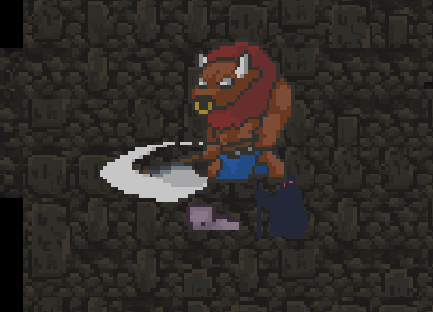

# Toasted Company

_**Fait par Vincent Bureau**_

## Description

Toasted Company est un jeu insiré du titre populaire Lethal Company. Le but du jeu est de est de trouver des objets ayant de la valeur dans un dongeon et de les ramener à la sortie pour amasser des points. Le jeu se déroule par niveau et chaque niveau est plus difficile que le précédent jusqu'à l'infini.

## Concepts utilisés

[Génération procédurale](#1-generation-procedurale)
[Pièges](#2-pieges)
[State Machine](#3-state-machine)
[Inventaire](#4-inventaire)

### 1. Generation procédurale

Dans mon jeu j'ai utilisé le concept de génération procédurale pour créer mes niveaux. Il y a plusieurs manière pour générer de facon aléatoire un niveau, mais j'ai choisi une génération de type room-based. Cela signifie que je crée des salles de différentes tailles et je les connecte entre elles pour former un niveau. Une fois le terain généré, un deuxieme algorithme parcours tout le dongeon et place des murs aux endroits appropriés.

Inspiration partielle de ce projet: https://www.youtube.com/watch?v=_BABPmlkqh8

Exemple de génération de niveau

### 2. Pièges

Pour rendre le jeu plus difficile, j'ai ajouté des pièges. Les pièges sont des `spikes` cachés dans le sol qui se déclenchent lorsque le joueur marche dessus. Les pièges s'activent pendant un certain temps et infligent des dégâts au joueur. Pour éviter les pièges, le joueur doit être attentif,car ils sont très peu visible et peuvent vous empecher de circuler dans un petit couloir temporairement.

Piege inactif

Piege actif

### 3. State Machine

Il existe 2 types d'ennemie dans mon jeux, les minotaurs et les mages noirs. Pour gérer le comportement des monstres, j'ai utilisé une machine à état. Chaque monstre a un état qui détermine son comportement. Par exemple, le minotaure a 3 états: `Idle`, `taunt` et `Attack`. Lorsque le joueur est à portée, le minotaure passe en mode `taunt` et lorsqu'il est à portée d'attaque, il passe en mode `Attack`. De plus le mage noir a 2 états: `Idle` et `Attack`. Lorsque le joueur est à portée, le mage noir passe en mode `Attack`. Chaque état a un comportement différent et permet de rendre les monstres plus intelligents.

Minotaure en mode `Taunt`

Minotaure en mode `Attack`

Minotaure pendant `Attack`

Mage noir en mode `Idle`

Mage noir en mode `Attack`

### 4. Inventaire

Pour gérer les objets que le joueur ramasse, j'ai utilisé un système d'inventaire. Lorsque le joueur ramasse un objet, il est ajouté à son inventaire. L'inventaire est limité à 2 objets. Lorsque le joueur ramasse un objet, sa vitesse diminue et voit moins loin. Pour déposer un objet, le joueur doit se rendre à la sortie du niveau. Lorsque le joueur dépose un objet, il gagne des points. Chaque objet a une valeur différente aléatoire et leur valeur moyenne augmente avec le niveau.

Inventaire du joueur

Objet à ramasser
