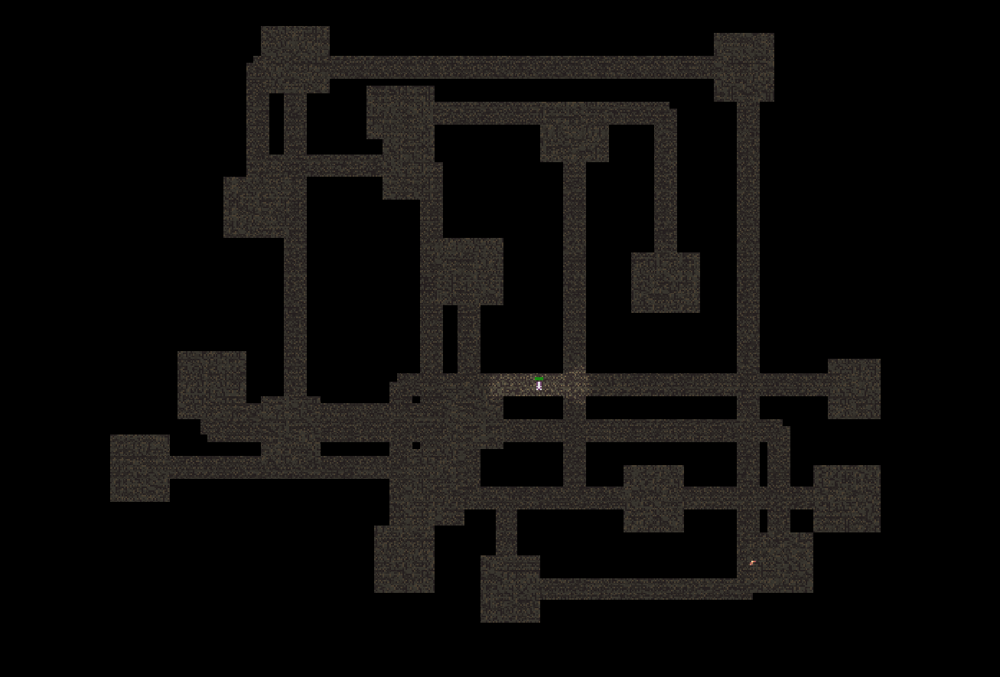
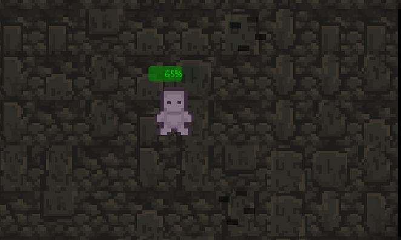
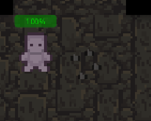
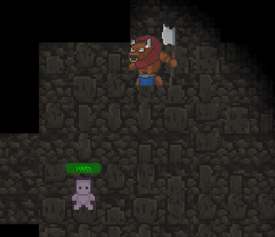
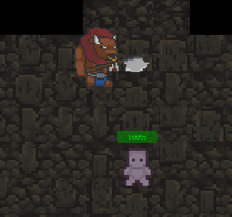
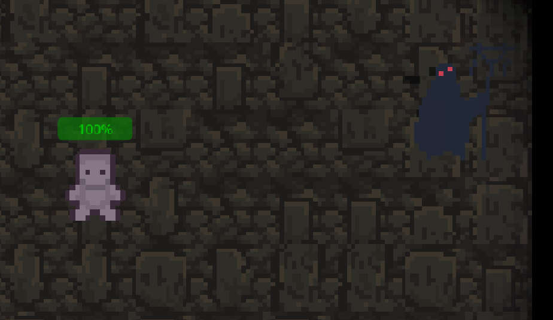
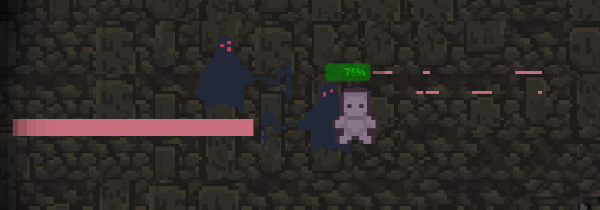
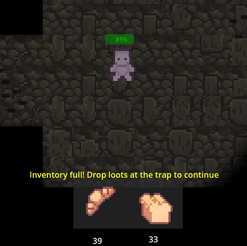
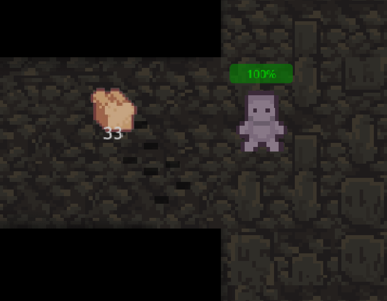

# Toasted Company

_**Créé par Vincent Bureau**_

---

## Description

**Toasted Company** est un jeu inspiré du titre populaire _Lethal Company_. Le but du jeu est de trouver des objets de valeur dans un donjon et de les ramener à la sortie pour amasser des points. Le jeu est structuré par niveaux, chaque niveau devenant de plus en plus difficile jusqu'à l'infini.

---

## Concepts utilisés

- [Génération procédurale](#1-génération-procédurale)
- [Pièges](#2-pièges)
- [State Machine](#3-state-machine)
- [Inventaire](#4-inventaire)

---

### 1. Génération procédurale

Dans ce projet, j'ai utilisé le concept de génération procédurale pour créer les niveaux. Il existe plusieurs façons de générer un niveau de manière aléatoire, mais j'ai choisi une génération de type _room-based_. Cela signifie que je crée des salles de différentes tailles, connectées entre elles pour former un donjon. Une fois le terrain généré, un second algorithme parcourt le donjon et place des murs aux endroits appropriés.

Inspiration partielle de ce projet : [Vidéo YouTube](https://www.youtube.com/watch?v=_BABPmlkqh8)

    

---

### 2. Pièges

Pour rendre le jeu plus difficile, j'ai ajouté des pièges. Les pièges sont des **pointes cachées** dans le sol qui se déclenchent lorsque le joueur marche dessus. Ils restent activés pendant un certain temps et infligent des dégâts. Pour les éviter, le joueur doit être attentif, car ils sont peu visibles et peuvent bloquer un passage étroit temporairement.

#### Exemple de piège :

    
     
    <em>Piège inactif</em>

    
     
    <em>Piège actif</em>

---

### 3. State Machine

Il existe deux types d'ennemis dans le jeu : **minotaures** et **mages noirs**. Pour gérer leur comportement, j'ai utilisé une machine à états (_State Machine_). Chaque monstre possède des états qui dictent son comportement :

- **Minotaure** :

  - `Idle` : Attente passive.
  - `Taunt` : Provoque le joueur s'il est à portée.
  - `Attack` : Attaque lorsque le joueur est suffisamment proche.

- **Mage noir** :
  - `Idle` : Attente passive.
  - `Attack` : Attaque à distance lorsqu'il détecte le joueur.

#### Illustrations des comportements :

    
     
    <em>Minotaure en mode Taunt</em>

    
     
    <em>Minotaure en mode Attack</em>

    
     
    <em>Mage noir en mode Idle</em>

    
     
    <em>Mage noir en mode Attack</em>

---

### 4. Inventaire

Le joueur peut ramasser des objets et les stocker dans un inventaire. Cependant, cet inventaire est limité à **2 objets**. Lorsque le joueur porte des objets, sa vitesse diminue, et son champ de vision se réduit. Pour déposer les objets, il doit se rendre à la sortie du niveau. Chaque objet a une valeur générée aléatoirement, et cette valeur moyenne augmente avec les niveaux.

#### Illustrations de l'inventaire :

    
     
    <em>Inventaire du joueur</em>

    
     
    <em>Objet à ramasser</em>

---

## Conclusion

Toasted Company est un jeu qui mêle aventure, réflexion, et défis croissants grâce à des concepts comme la génération procédurale, des pièges rusés, des ennemis dynamiques et une gestion d'inventaire stratégique. À vous de jouer !
